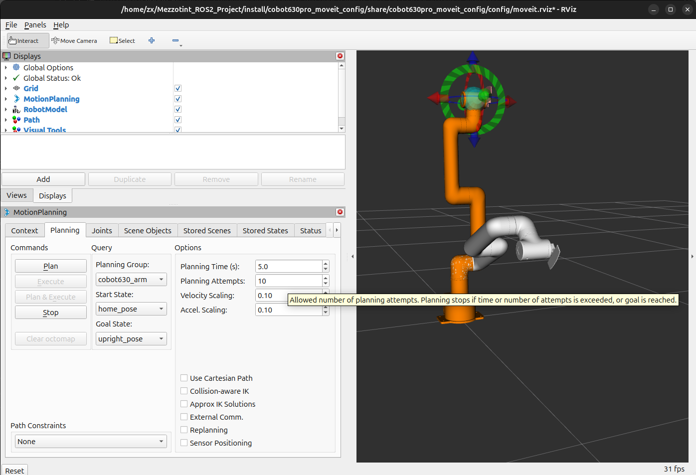
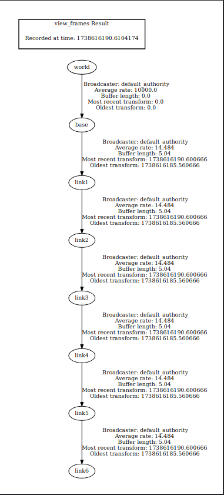

# 2. MoveIt Configuration Tutorial for MyCobot 630 Pro

## Objectives

- Configure MoveIt for the MyCobot 630 Pro robotic arm
- Set up planning groups and controllers
- Prepare for motion planning and control

## Prerequisites

- ROS2 Jazzy Jalisco installed
- Completed mycobot630pro_description package
- MoveIt 2 installed
- MoveIt Setup Assistant

## Step 1: Launch MoveIt Setup Assistant

- The MoveIt Setup Assistant is a graphical user interface for configuring any robot for use with MoveIt. Its primary function is generating a *Semantic Robot Description Format (SRDF)* file for your robot, which specifies additional information required by MoveIt such as *planning groups*, *end effectors*, and various *kinematic* parameters. Additionally, it generates other necessary configuration files for use with the MoveIt pipeline.

```bash
# Launch MoveIt Setup Assistant
ros2 launch moveit_setup_assistant setup_assistant.launch.py
```

- Follow this guide of how to use moveit Setup Assistant GUI to generate the moveit configuration package and ***SRDF*** file from the ***URDF*** file of *mycobot630pro_description* package:
    
    [MoveIt Setup Assistant Guide](https://moveit.picknik.ai/main/doc/examples/setup_assistant/setup_assistant_tutorial.html)
    

## Step 2: Building the package

```bash
# Navigate to workspace directory
cd ~/colcon_ws/
# build the package
colcon build --symlink-install --packages-select cobot630pro_moveit_config
# Source workspace
source install/setup.bash
```

## Step 3: Test Moveit Pipeline

```bash
# Launch demo.launch
ros2 launch cobot630pro_moveit_config demo.launch.py
```

- Rviz should launch with the Robot model spawned and you can test the control and planning by executing different pre-defined positions or a custom goal you can set by moving the end-point of the planning group to other location in the workspace of the arm, then `plan&execute`
    
    
    

## Planning Groups Configuration

### Main Arm Planning Group: `cobot630_arm`

- **Joints**:
    1. joint0
    2. joint1
    3. joint2
    4. joint3
    5. joint4

### Tool Planning Group: `cobot_tool`

- **Joint**:
    1. joint5

## Kinematics Configuration

### Solver Details

- **Kinematics Solver**: KDL (Kinematics and Dynamics Library)
- **Plugin**: `kdl_kinematics_plugin/KDLKinematicsPlugin`
- **Search Resolution**: 0.005
- **Solver Timeout**: 0.005 seconds

## Controller Configuration

### Controller Manager

- Type: `moveit_simple_controller_manager/MoveItSimpleControllerManager`

### Arm Controller

- Name: `cobot630_arm_controller`
- Type: `FollowJointTrajectory`
- Controlled Joints:
    - joint0
    - joint1
    - joint2
    - joint3
    - joint4

### Tool Controller

- Name: `cobot_tool_controller`
- Type: `FollowJointTrajectory`
- Controlled Joint:
    - joint5

## ROS2 Controllers Configuration

### Controller Manager Parameters

- **Update Rate**: 100 Hz
- **Controller Types**: `joint_trajectory_controller/JointTrajectoryController`

### Joint Interface Configuration

- **Command Interfaces**: position
- **State Interfaces**: position, velocity
- **Allow Non-Zero Velocity at Trajectory End**: Yes

## Key Configuration Files

### kinematics.yaml

```yaml
cobot630_arm:
  kinematics_solver: kdl_kinematics_plugin/KDLKinematicsPlugin
  kinematics_solver_search_resolution: 0.005
  kinematics_solver_timeout: 0.005
```

### moveit_controllers.yaml

```yaml
# MoveIt uses this configuration for controller management

moveit_controller_manager: moveit_simple_controller_manager/MoveItSimpleControllerManager

moveit_simple_controller_manager:
  controller_names:
    - cobot630_arm_controller
    - cobot_tool_controller

  cobot630_arm_controller:
    type: FollowJointTrajectory
    joints:
      - joint0
      - joint1
      - joint2
      - joint3
      - joint4
    action_ns: follow_joint_trajectory
    default: true
  
  cobot_tool_controller:
    type: FollowJointTrajectory
    joints:
      - joint5
    action_ns: follow_joint_trajectory
```

### ros2_controllers.yaml

```yaml
# This config file is used by ros2_control
controller_manager:
  ros__parameters:
    update_rate: 100  # Hz

    cobot630_arm_controller:
      type: joint_trajectory_controller/JointTrajectoryController

    cobot_tool_controller:
      type: joint_trajectory_controller/JointTrajectoryController

    joint_state_broadcaster:
      type: joint_state_broadcaster/JointStateBroadcaster

cobot630_arm_controller:
  ros__parameters:
    joints:
      - joint0
      - joint1
      - joint2
      - joint3
      - joint4
    command_interfaces:
      - position
    state_interfaces:
      - position
      - velocity
    allow_nonzero_velocity_at_trajectory_end: true

cobot_tool_controller:
  ros__parameters:
    joints:
      - joint5
    command_interfaces:
      - position
    state_interfaces:
      - position
      - velocity
    allow_nonzero_velocity_at_trajectory_end: true
```

## References

- [MoveIt 2 Documentation](https://moveit.picknik.ai/main/index.html)
- [ROS2 Control Overview](https://control.ros.org/jazzy/index.html)
- [URDF & SRDF](https://moveit.picknik.ai/main/doc/examples/urdf_srdf/urdf_srdf_tutorial.html)
- Other Inverse Kinematics Solvers:
    - [Pick IK](https://github.com/PickNikRobotics/pick_ik)
    - [IKFast](https://moveit.picknik.ai/main/doc/examples/ikfast/ikfast_tutorial.html)

## Troubleshooting

- Verify URDF compatibility
- Check joint limits and workspace
- Validate controller configurations
- Verify Correct TF tree using `tf2_tools` package, `view_frames` node
    
    ```bash
    # Launch the demo of moveit config package
    ros2 launch cobot630pro_moveit_config demo.launch.py 
    # Run tf2_tools view_frames node to listen to transforms being published
    # and create the tf tree
    ros2 run tf2_tools view_frames
    ```
    
    This will create a .gv and .pdf files that has the frames tree to check. The tf tree should be all connected from ***/world*** frame to ***/link6*** frame like this:
    
    