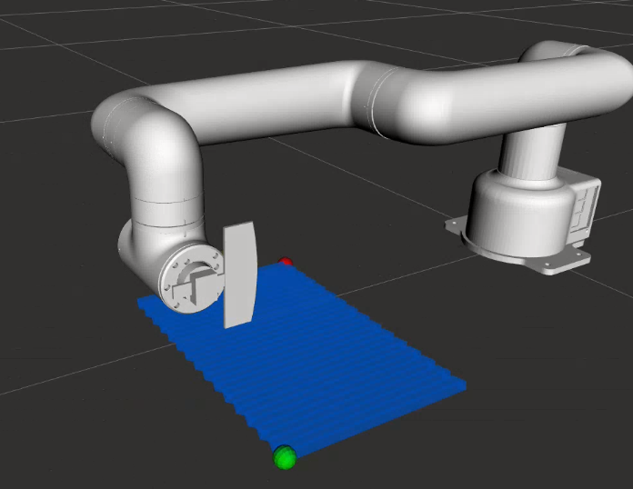

# Mycobot 630 Pro Mezzotint ROS2 Project

<div align="center">
    
    
</div>

<div align="center">
    
</div>
## Overview
This project implements an automated mezzotint printmaking process using the Mycobot 630 Pro robotic arm. The system replicates the traditional hand-rocking motion used in mezzotint printmaking on copper plates, leveraging ROS2's Jazzy Jalisco distribution and MoveIt2 for motion planning and control.

## System Requirements

### Operating System
- Ubuntu 24.04 LTS (*Noble Numbat*)

### ROS2 Distribution
- ROS2 Jazzy Jalisco

### Hardware
- Mycobot 630 Pro Robotic Arm
- Modified End-effector (Mezzotint Rocker Tool)

### Key Dependencies
- MoveIt2
- Open Motion Planning Library (OMPL)
- KDL Kinematics Plugin

## Project Structure

### Packages Overview

#### 1. mycobot630pro_description
Contains the robot arm model and associated files:
- URDF (Unified Robot Description Format) model
- DAE (COLLADA) files for robot parts
- Modified link6.dae incorporating the mezzotint rocker tool
- Launch files for model visualization

#### 2. cobot630pro_moveit_config
MoveIt2 configuration package including:
- KDL inverse kinematics solver setup
- Controller manager configuration
- OMPL planning pipeline settings
- Planning groups configuration:
  - cobot630_arm
  - cobot_tool
- Predefined robot states
- RViz configurations for visualization

#### 3. cobot_interfaces
Custom interfaces package containing:
- Service definitions
- Message definitions
- Action definitions

#### 4. mycobot_path_planner
Path planning implementation package:
- Path generation service server for mezzotint operation
- RViz visualization using MarkerArray
- Motion planning algorithms
- Path optimization utilities

## Installation

For detailed installation instructions for both Linux and MacOS environments, please refer to our [Setup Manual](setup-manual.md).

## Available Services

### Path Planning Service
The path planning service generates the mezzotint tool path based on given parameters.

**Service Type**: `cobot_interfaces/srv/PlanPath`

**Service Definition**:
```
# Request
float64[] start_point # [x, y, z]
float64[] end_point # [x, y, z]
float64 resolution # Path resolution
float64 pitch_distance # Distance between zigzag lines
---
# Response
bool success
geometry_msgs/Point[] path_points # List of points in the generated path
```

**Example Usage**:
```bash
# Using command line
ros2 service call /plan_path cobot_interfaces/srv/PlanPath "{
  start_point: [0.5, 0.2, 0.0],
  end_point: [0.3, -0.1, 0.0],
  resolution: 0.05,
  pitch_distance: 0.01
}"
```

**Parameters**:
- `start_point`: Starting coordinates [x, y, z] of the mezzotint area
- `end_point`: Ending coordinates [x, y, z] of the mezzotint area
- `resolution`: Distance between consecutive points in the path (meters)
- `pitch_distance`: Distance between parallel zigzag lines (meters)

**Response**:
- `success`: Boolean indicating if path generation was successful
- `path_points`: Array of 3D points representing the generated tool path
  
## Usage

### Starting the System
```bash
# launch move group demo.launch
ros2 launch cobot630pro_moveit_config demo.launch.py
```

### Launching Path Planner Server
```bash
# In a new terminal, Start the path planning service
ros2 launch mycobot_path_planner path_planner.launch.py

# In a new terminal, launch rqt_service_caller to request /plan_path service with request variables from the example
ros2 run rqt_service_caller rqt_service_caller
```

## Development Status
- ✅ Robot model and configuration
- ✅ MoveIt2 integration
- ✅ Basic path planning
- ✅ Visualization tools
- 🚧 [Future packages/features will be listed here]

---
<div align="center">
  <small>Built with ROS2 Jazzy Jalisco and MoveIt2</small>
</div>


```
### Session Start
cd /home/ubuntu/Projects/ros2_mezzotint
rm -rf build install log
colcon build --symlink-install
source /opt/ros/jazzy/setup.bash
source install/setup.bash
```